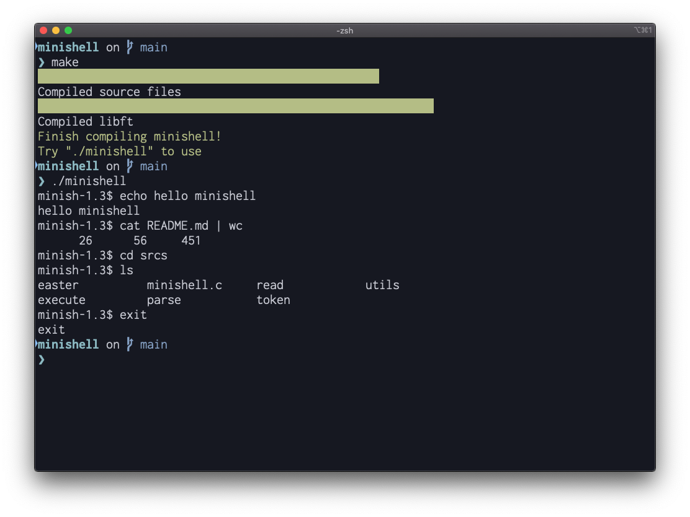

# minishell

## Description
simple shell like bash

## Requirement
* GCC
* GNU Make

## Installation
```shell
git clone --recursive git@github.com:tkomatsu/minishell.git
cd minishell
make
```

## Usage
```shell
./minishell
```

## Authors
* **[Tatsuhiro Komatsu](https://github.com/tkomatsu)**
* **[Kenshi Fujiwara](https://github.com/kefujiwa)**

## License
This project is licensed under the MIT License - see the [LICENSE](LICENSE) file for details
